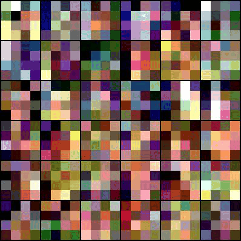

# ALAE
Implementation of the paper "Adverserial Latent AutoEncoder" done for my MSc LabProject at HUJI. \
The paper: https://arxiv.org/abs/2004.04467 \
Official implementation https://github.com/podgorskiy/ALAE

# Step 1: Implement FC-ALAE and train on mnist
The training result of 100 epochs

# Step 2: Implement Style-GAN
Style gan with no tricks:

# Step 3: Implement Style-ALE on FFGQ

 
### Equalized learnig rate:
The authors claim to use a method presented in the Progressively growing GANs (PGGANs) paper called
PGGANs Equalized Learning Rate: 
>"For updatingthe weights we use the Adam optimizer [26] withβ1= 0.0andβ2= 0.99,
 coupled with the learning rate equalizationtechnique [23] described below."

Apart from the fact that no description is added "below", the implementation of a LREQAdam 
in the repository shows a quite pecuiliar optimizer which does not fit to the description in the PGGANs paper.

Here is the description of this method from the PGGANs paper:
>We deviate from the current trend of careful weight initialization, and instead use a trivialN(0,1)initialization and 
>then explicitly scale the weights at runtime.  To be precise, we setˆwi=wi/c,wherewiare the weights andcis the 
>per-layer normalization constant from He’s initializer (Heet al., 2015).   The benefit of doing this dynamically 
>instead of during initialization is somewhatsubtle, and relates to the scale-invariance in commonly used adaptive 
>stochastic gradient descentmethods such as RMSProp (Tieleman & Hinton, 2012) and Adam (Kingma & Ba, 2015).  
>Thesemethods normalize a gradient update by its estimated standard deviation, thus making the updateindependent 
>of the scale of the parameter.  As a result, if some parameters have a larger dynamicrange than others, they will
> take longer to adjust.  This is a scenario modern initializers cause, andthus it is possible that a learning rate 
>is both too large and too small at the same time. Our approachensures that the dynamic range, and thus the learning 
>speed, is the same for all weights.  A similarreasoning was independently used by van Laarhoven (2017).

This is from a post about PGGans: https://towardsdatascience.com/progan-how-nvidia-generated-images-of-unprecedented-quality-51c98ec2cbd2
which offers some explenation but I'm not sure where it dervives its conclusions from
>The authors found that to ensure healthy competition between the generator and discriminator, it is essential that 
>layers learn at a similar speed. To achieve this equalized learning rate, they scale the weights of a layer according 
>to how many weights that layer has. They do this using the same formula as is used in He initialization, except they 
>do it in every forward pass during training, rather than just at initialization.
Learning rates can be equalized across layers by scaling the weights before every forward pass. For example, before 
>performing a convolution with f filters of size [k, k, c], we would scale the weights of those filters as shown above.
>Due to this intervention, no fancy tricks are needed for weight initialization — simply initializing weights with a 
>standard normal distribution works fine.
>
# Relevant papers:
- PGGANs: https://arxiv.org/pdf/1710.10196.pdf
- StyleGAN: https://arxiv.org/abs/1812.04948

# Credits:
I Consulted and used parts of the codes in
* https://github.com/podgorskiy/ALAE
* https://github.com/rosinality/style-based-gan-pytorch.git
* https://github.com/SiskonEmilia/StyleGAN-PyTorch.git